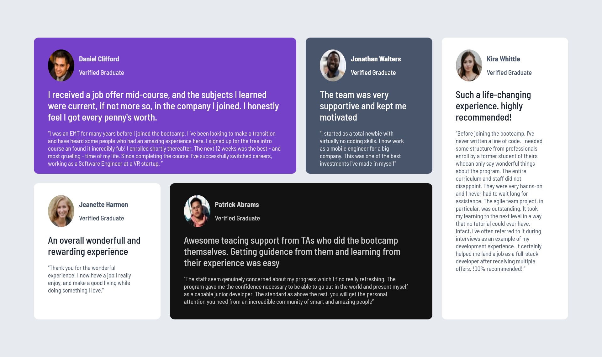

# Frontend Mentor - Testimonials grid section solution

This is a solution to the [Testimonials grid section challenge on Frontend Mentor](https://www.frontendmentor.io/challenges/testimonials-grid-section-Nnw6J7Un7). 

## Table of contents

- [Overview](#overview)
  - [The challenge](#the-challenge)
  - [Screenshot](#screenshot)
  - [Links](#links)
- [My process](#my-process)
  - [Built with](#built-with)
  - [What I learned](#what-i-learned)
  - [Useful resources](#useful-resources)
- [Author](#author)

## Overview

### The challenge

Users should be able to:

- View the optimal layout for the site depending on their device's screen size

### Screenshot

### Links

- Solution URL: [Github repo](https://github.com/akin-holo/frontendmentor-challenge-8-testimony)
- Live Site URL: [frontendmentor-solution-testimonial-g.netlify.app/](https://frontendmentor-solution-testimonial-g.netlify.app/)

## My process

### Built with

- Semantic HTML5 markup
- CSS custom properties
- CSS Grid

### What I learned

I learned how to layout components using CSS Grid

### Useful resources

- [CSS Grid by Wes Bos](https://www.youtube.com/watch?v=T-slCsOrLcc&list=PLu8EoSxDXHP5CIFvt9-ze3IngcdAc2xKG&index=1) - I have never understood CSS grid layout. The Web Bos CSS Grid tutorial made me to understand it. I liked how he simplified it.

## Author

- Frontend Mentor - [@akin-holo](https://www.frontendmentor.io/profile/akin-holo)
- Twitter - [@AkinHolo](https://x.com/AkinHolo)
